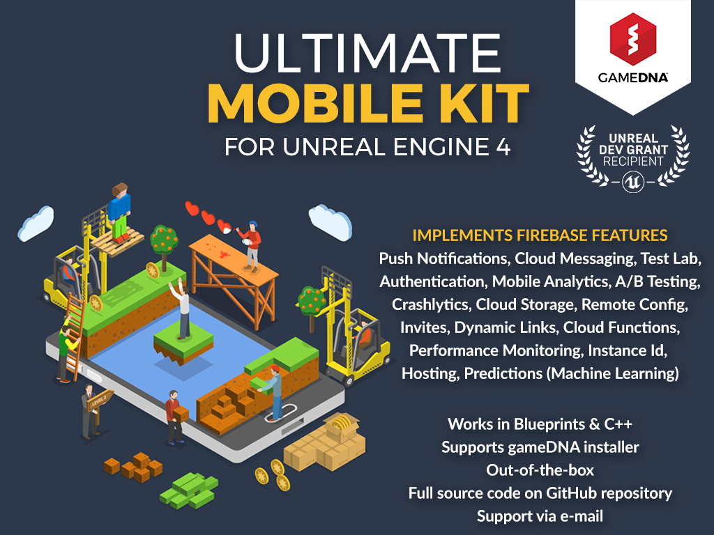

# Ultimate Mobile Kit

**Ultimate Mobile Kit** is a plugin for UE4 that lets you integrate the Firebase platform for iOS & Android. 
Firebase is a platform that helps you quickly develop high-quality experiences, grow your user base, and earn more money. Firebase is made up of complementary features that you can mix-and-match to fit your needs. You can focus on making your game and not waste time building complex infrastructure.

* **Current version:** 1.12.0
* **Binaries compiled for:** Unreal Engine 4.23
* **Required Unreal Engine 4.23 or above.**

## Features
* **Mobile Analytics** - heart of Firebase, see user behavior and measure attribution from a single dashboard.
* **Cloud Messaging** - lets you reliably deliver and receive messages at no cost.
* **Push Notifications** - schedule and send from dashboard unlimited notifications to engage the right players at the most relevant time.
* **Authentication** - complete authentication system that supports email & password, Facebook, Twitter, GitHub, Google, Google Play, Game Center, and Phone Number Authentication.
* **Instance Id** - generate unique user IDs for authentication and security tokens for use with other services.
* **Cloud Storage** - store and serve user-generated content like save games, images, audio, video or binary data.
* **Remote Config** - update your game without deploying a new version and customize content for different Firebase Analytics audiences and measure results.
* **Performance Monitoring** – get insights into how your game performs from your users’ point of view, with automatic and customized performance tracing.
* **Crashlytics** - track, prioritize, and fix stability issues with lightweight but powerful, realtime crash reporter that improves your game quality.
* **Dynamic Links** - improve acquisition and engagement by bringing users directly to content that they were originally searching for, whether they have your game installed or not.
* **Invites** - complete solution for game referrals and sharing, free email and SMS delivery, let your existing players easy share your game.
* **In-App Messaging** - engage users by sending them targeted and contextual messages that nudge them to complete key in-app actions.
* **Test Lab** - test your games on physical and virtual devices hosted by Google that allow you to run tests that simulate actual usage environments.
* **Cloud Functions** (server side) - run backend code without managing servers and keep your logic private and secure.
* **Predictions** - use the power of Google's machine learning to create dynamic user groups based on players' predicted behavior.
* **A/B Testing** - create experiments to optimize the users experience for a business goal.
* **Hosting** - deploy web page with speed and security without all the hassle.
* All features are exposed to Blueprints.
* [Supports gameDNA installer](https://github.com/gameDNAstudio/gameDNAinstaller). No more downloading SDKs and creating packages on your own!
* Out-of-the-box for mobile platforms: iOS & Android.
* Works with Blueprint-only & source code projects.
* Works with Launcher & GitHub UE4 versions.

## User Guide
More info about plugin and installation instructions you can find in [User Guide](Documentation/UltimateMobileKit_UserGuide.pdf).
