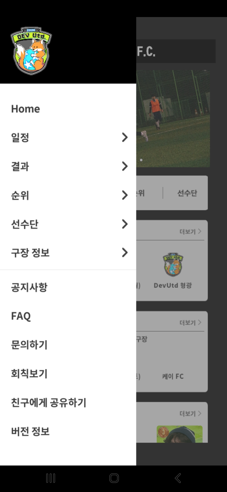

# DevUtd_App

2020년 창단한 아마추어 축구팀 데브 유나이티드 FC의 공식 어플

## 🖥️ 프로젝트 소개
제가 활동하고 있는 아마추어 축구팀 데브 유나이티드 FC의 경기 일정, 여러가지 기록 정보등을 팀원들과 공유하기 위해 개발한 어플입니다. 
 

## 🕰️ 개발 기간
* 21년 11월 ~ 21년 12월
* 개발 이후 필요할때마다 업데이트 중

## ⚙️ 개발 환경
- `Visual Studio 2019`
- `Firebase`
- `UE4`

## 📌 주요 기능
#### 일정 보기
- Firebase Database 연동
- 남은 경기 일정들을 볼 수 있는 기능
-  
  

#### 결과 보기
- Firebase Database 연동
- 지금까지의 경기 결과 보기 기능
-  
  
  
#### 순위 보기
- Firebase Database 연동
- 분야별(득점, 도움, 출석등) 기록 순위 보기 기능
- 필터 기능 : 기간, 구장, 상대팀 필터 기능을 제공하여 원하는 조건의 순위만 보도록 하는 기능
-   
  

#### 선수단 정보
- Firebase Database 연동
- 이미지 호스팅 postimage 사용
- 선수단, 코치진등 인원 구성을 확인 할 수 있는 기능
- 

#### 선수 정보
- Firebase Database 연동
- 선수의 주요 스탯 및 득점, 도움 기간별 그래프를 볼 수 있는 기능
- 

#### 선수 비교하기
- 선수들간의 주요 스탯을 비교할 수 있는 기능
- 

#### 구장 정보
- 팀에서 경기하는 구장들의 정보
- 주소 및 길찾기 기능 제공
- 

#### 공지사항
- Firebase Remote Config 연동
- 팀의 공지 및 징계등을 확인할 수 있는 기능
- 
  
#### 1대1문의 및 공유하기
- 이메일 문의하기 기능
- 어플을 쉽게 공유할 수 있는 공유 링크 전달 기능
- 
